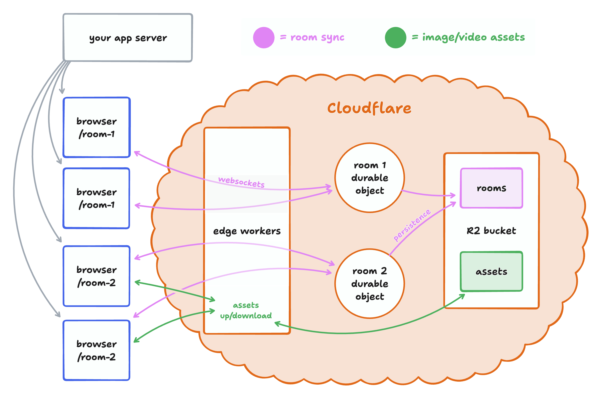

# tldraw sync server

This is a production-ready backend for [tldraw sync](https://tldraw.dev/docs/sync). This is a fork of the original [repository](https://github.com/tldraw/tldraw-sync-cloudflare), but modified to build and deploy completely on to a single Cloudflare Workers project.

- This app uses [Cloudflare Workers](https://developers.cloudflare.com/workers/), and will need
  to be deployed to your own Cloudflare account.
- Each whiteboard is synced via
  [WebSockets](https://developer.mozilla.org/en-US/docs/Web/API/WebSockets_API) to a [Cloudflare
  Durable Object](https://developers.cloudflare.com/durable-objects/).
- Whiteboards and any uploaded images/videos are stored in a [Cloudflare
  R2](https://developers.cloudflare.com/r2/) bucket.
- Although unreliated to tldraw sync, this server also includes a component to fetch link previews
  for URLs added to the canvas.
  This is a minimal setup of the same system that powers multiplayer collaboration for hundreds of
  thousands of rooms & users on www.tldraw.com. Because durable objects effectively create a mini
  server instance for every single active room, we've never needed to worry about scale. Cloudflare
  handles the tricky infrastructure work of ensuring there's only ever one instance of each room, and
  making sure that every user gets connected to that instance. We've found that with this approach,
  each room is able to handle about 30 simultaneous collaborators.

## Overview

When a user opens a room, they connect via Workers to a durable object. Each durable object is like
its own miniature server. There's only ever one for each room, and all the users of that room
connect to it. When a user makes a change to the drawing, it's sent via a websocket connection to
the durable object for that room. The durable object applies the change to its in-memory copy of the
document, and broadcasts the change via websockets to all other connected clients. On a regular
schedule, the durable object persists its contents to an R2 bucket. When the last client leaves the
room, the durable object will shut down.

Static assets like images and videos are too big to be synced via websockets and a durable object.
Instead, they're uploaded to workers which store them in the same R2 bucket as the rooms. When
they're downloaded, they're cached on cloudflare's edge network to reduce costs and make serving
them faster.

## Development

To install dependencies, run `npm install`. To start a local development server, run `npm start`. This will
start a [`vite`](https://vitejs.dev/) dev server for your application.

The backend worker is under [`worker`](./worker/), and is split across several files:

- **[`worker/worker.ts`](./worker/worker.ts):** the main entrypoint to the worker, defining each
  route available.
- **[`worker/TldrawDurableObject.ts`](./worker/TldrawDurableObject.ts):** the sync durable object.
  An instance of this is created for every active room. This exposes a
  [`TLSocketRoom`](https://tldraw.dev/reference/sync-core/TLSocketRoom) over websockets, and
  periodically saves room data to R2.
- **[`worker/assetUploads.ts`](./worker/assetUploads.ts):** uploads, downloads, and caching for
  static assets like images and videos.
- **[`worker/bookmarkUnfurling.ts`](./worker/bookmarkUnfurling.ts):** extract URL metadata for bookmark shapes.

The frontend client is under [`client`](./client):

- **[`client/App.tsx`](./client/App.tsx):** the main client `<App />` component. This connects our
  sync backend to the `<Tldraw />` component, wiring in assets and bookmark previews.
- **[`client/multiplayerAssetStore.tsx`](./client/multiplayerAssetStore.tsx):** how does the client
  upload and retrieve assets like images & videos from the worker?
- **[`client/getBookmarkPreview.tsx`](./client/getBookmarkPreview.tsx):** how does the client fetch
  bookmark previews from the worker?

  ## Custom shapes

To add support for custom shapes, see the [tldraw sync custom shapes docs](https://tldraw.dev/docs/sync#Custom-shapes--bindings).

## Deployment

To deploy this example, you'll need to create a cloudflare account and create an R2 bucket to store
your data. Update `bucket_name = 'tldraw-content'` in [`wrangler.toml`](./wrangler.toml) with the
name of your new bucket.

Run `npm run deploy` to deploy your app. This should give you a workers.dev URL, but you can
also [configure a custom
domain](https://developers.cloudflare.com/workers/configuration/routing/custom-domains/).

When you visit your published client, it should sync your document across devices.

## License

This project is provided under the MIT license found [here](https://github.com/tldraw/tldraw-sync-cloudflare/blob/main/LICENSE.md). The tldraw SDK is provided under the [tldraw license](https://github.com/tldraw/tldraw/blob/main/LICENSE.md).

## Trademarks

Copyright (c) 2024-present tldraw Inc. The tldraw name and logo are trademarks of tldraw. Please see our [trademark guidelines](https://github.com/tldraw/tldraw/blob/main/TRADEMARKS.md) for info on acceptable usage.

## Distributions

You can find tldraw on npm [here](https://www.npmjs.com/package/@tldraw/tldraw?activeTab=versions).

## Contribution

Please see our [contributing guide](https://github.com/tldraw/tldraw/blob/main/CONTRIBUTING.md). Found a bug? Please [submit an issue](https://github.com/tldraw/tldraw/issues/new).

## Community

Have questions, comments or feedback? [Join our discord](https://discord.tldraw.com/?utm_source=github&utm_medium=readme&utm_campaign=sociallink). For the latest news and release notes, visit [tldraw.dev](https://tldraw.dev).

## Contact

Find us on Twitter/X at [@tldraw](https://twitter.com/tldraw).
